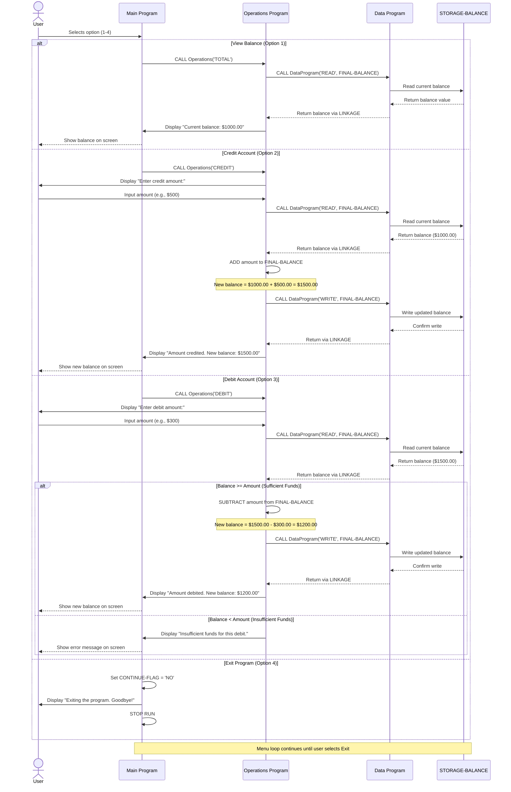

# Student Account Management System - COBOL Documentation

## Overview
This COBOL-based application implements a **Student Account Management System** designed to manage student account balances with core operations for viewing, crediting, and debiting funds. The system ensures financial integrity through balance validation and maintains persistent account data.

---

## COBOL Files Overview

### 1. **main.cob** - Main Program Entry Point
**Purpose:** Serves as the primary user interface and orchestrator for the account management system.

**Key Functions:**
- Displays an interactive menu with four options
- Manages user input and menu navigation
- Controls program flow through a loop that continues until user selects "Exit"
- Routes user selections to the appropriate operations via the `Operations` program

**Menu Options:**
1. View Balance - Check current account balance
2. Credit Account - Add funds to the account
3. Debit Account - Withdraw funds from the account
4. Exit - Terminate the program

**Business Rules:**
- User remains in the menu loop until explicitly choosing to exit
- Invalid input (non-1-4 selections) displays an error message and re-prompts for input

---

### 2. **data.cob** - Data Management Program
**Purpose:** Manages persistent account data storage and retrieval, serving as the application's data access layer.

**Key Functions:**
- **READ Operation:** Retrieves the current account balance from `STORAGE-BALANCE`
- **WRITE Operation:** Updates the account balance in persistent storage

**Data Elements:**
- `STORAGE-BALANCE`: PIN 9(6)V99 - Stores the account balance (format: XXXXXX.XX, range $0.00 to $999,999.99)
- Initial Balance: $1,000.00

**Business Rules:**
- Balance is stored with 2 decimal places for currency representation (cents)
- Balance persists across multiple operations during a program session
- Data is passed via LINKAGE SECTION for interprocess communication

---

### 3. **operations.cob** - Business Logic Operations
**Purpose:** Implements the core business logic for account operations with validation and integrity checks.

**Key Functions:**

#### TOTAL (View Balance)
- Reads current balance from data storage
- Displays the current account balance to the user
- No modifications to account data

#### CREDIT (Add Funds)
- Prompts user to enter the credit amount
- Reads current balance
- Adds the credit amount to the current balance
- Writes the updated balance back to storage
- Displays the new balance to the user

#### DEBIT (Withdraw Funds)
- Prompts user to enter the debit amount
- Reads current balance
- **Business Rule Check:** Validates that current balance >= debit amount
  - If balance is sufficient: debits the amount and displays new balance
  - If balance is insufficient: displays error message and prevents the transaction
- Protects accounts from overdrafts with insufficient funds validation

**Data Elements:**
- `FINAL-BALANCE`: PIN 9(6)V99 - Working variable for balance calculations
- Initial Balance: $1,000.00

---

## Business Rules for Student Accounts

### Core Rules
1. **Initial Balance:** Every student account starts with $1,000.00
2. **Overdraft Protection:** Accounts cannot go into negative balance - debit operations that would create a negative balance are rejected
3. **Decimal Precision:** All transactions maintain 2 decimal place precision for currency calculations
4. **Operation Limits:** Maximum transaction amount is $999,999.99 (based on data type capacity)

### Transaction Rules
- **Credit Transactions:** Unlimited credit operations allowed, balance increases by specified amount
- **Debit Transactions:** Only allowed if sufficient funds are available; transaction is rejected with an error message if funds are insufficient
- **View Operations:** Balance inquiries have no restrictions and do not modify account data

### Data Integrity
- Each operation maintains data consistency through the READ-MODIFY-WRITE pattern
- Balance is read from persistent storage before modification
- Modified balance is written back to persistent storage only after validation
- No partial transactions - either the entire operation completes or it is rejected

---

## Program Flow Diagram

```
Main Program
    ↓
Display Menu
    ↓
Read User Choice
    ↓
Route to Operation:
    ├── Choice 1 → Operations (TOTAL) → Display Balance
    ├── Choice 2 → Operations (CREDIT) → Add Funds
    ├── Choice 3 → Operations (DEBIT) → Withdraw Funds (with validation)
    ├── Choice 4 → Exit Program
    └── Other → Display Error
    ↓
Return to Menu (unless Exit selected)
```

---

## Data Flow

```
Main Program Request
    ↓
Operations Program
    ├── Validate Operation Type
    ├── If READ/WRITE needed:
    │   ↓
    │   Data Program
    │   ├── STORAGE-BALANCE (Persistent Storage)
    │   └── Return Balance via Linkage Section
    ├── Process Operation
    └── Return Result to Main Program
    ↓
Display Result to User
```

---

## Technical Notes

- **Language:** COBOL
- **Architecture:** Multi-module program with separation of concerns (UI, Business Logic, Data Access)
- **Communication Method:** Interprogram communication via `CALL` statements with LINKAGE SECTION parameters
- **Data Type:** COMP-3 Packed Decimal (9(6)V99) for currency calculations
- **Session Persistence:** Balance persists for the duration of the program session

---

## Future Enhancement Opportunities
- Database integration for persistent storage across sessions
- User authentication and account-specific tracking
- Transaction history logging
- Multiple account support
- Input validation for amount entries (prevent negative or non-numeric input)
- Audit logging for regulatory compliance

---

## Sequence Diagram - Application Data Flow



### Sequence Diagram Notes

- **Synchronous Communication:** All COBOL program calls use `CALL` statements and wait for return values before proceeding
- **Data Consistency:** Balance is always read before modification to ensure current value is used
- **Validation:** Debit operations validate balance before allowing withdrawal
- **Transactional Integrity:** READ-MODIFY-WRITE pattern ensures no data loss or corruption
- **State Management:** `STORAGE-BALANCE` maintains account state throughout the session
- **Session Persistence:** Balance changes persist across multiple operations in the same program execution
